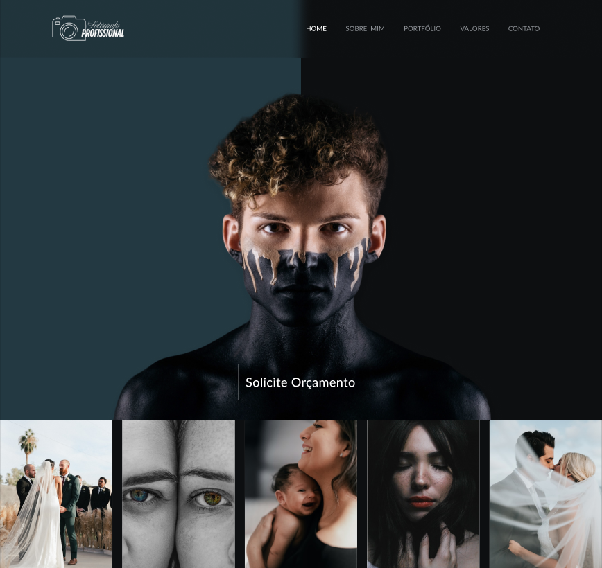

  <strong><code>Desenvolvedora FullStack</code></strong>
  <strong><code>UX/UI Designer</code></strong>
  <strong><code>Designer Instrucional</code></strong>
  <strong><code>Prof. IFSP - Caraguatatuba</code></strong>

  

  Oi! Eu sou a Marilene (ou Mari, pra quem preferir 😊). Trabalho com desenvolvimento web e atuo tanto na construção de aplicações completas quanto no ensino de programação em cursos técnicos e EAD. Sou daquelas que ama transformar ideias em projetos digitais funcionais e bonitos — sempre com HTML, CSS, JavaScript e React na manga.

Além de ensinar, também desenvolvo sites e sistemas personalizados pela minha empresa MD Soluções em TI. Curto muito criar conteúdos educativos, pensar na experiência do usuário (UX/UI) e aplicar boas práticas de código. Este repositório reúne alguns dos meus projetos, experimentações e conteúdos que compartilho com alunos e parceiros. Fique à vontade para explorar, contribuir ou entrar em contato.

Compartilho meu conhecimento através do meu canal no YouTube "[MD Cursos](https://www.youtube.com/@mdcursos)", onde ensino a criar projetos web, e também através do Instagram, com o perfil chamado "[MD Soluções em TI](https://www.instagram.com/mdcursosti/)".

---
### 🤖 Linguagens e Tecnologias

### Frontend

 

### Backend

 
### Banco de Dados

 

### Outros

 
 

---

### 🌎 Encontre-me na web

  

  

  

---

### 🎬 Meus últimos vídeos
|  |  |  |
|:--:|:--:|:--:|
| **Projeto Lanchonet** | **CSS Global** | **Menu** |

---

###  👩🏻‍💻 Projetos recentes
|  |  |  |
|:--:|:--:|:--:|
| **HTML/CSS/JS** | **Figma** | **Figma** |
